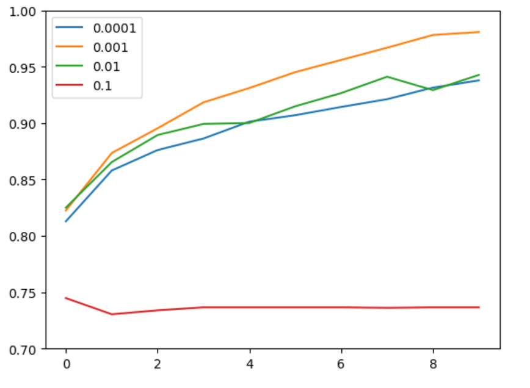
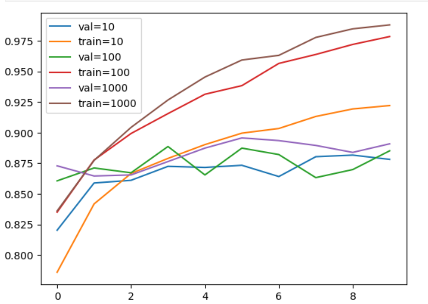
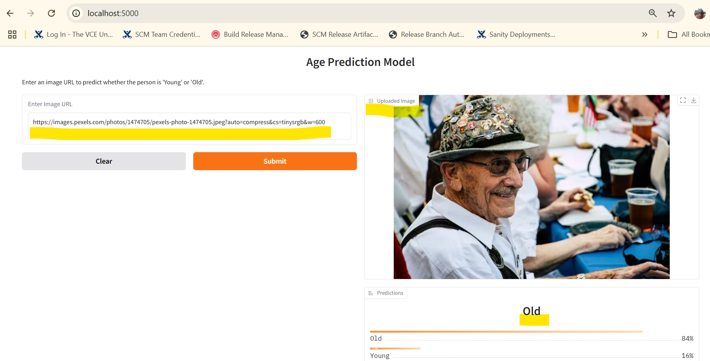

# ml-zoomcamp-capstone-2-2024
## Description
This is DataTalksClub [ML Zoomcamp](https://github.com/DataTalksClub/machine-learning-zoomcamp) capstone 2 project repo.

It is trained on human faces dataset and tries to pedict if person in the image url is young or old. 

Dataset credit: https://www.kaggle.com/datasets/goubeast/age-prediction-av

This model has different potential use cases:

Ex: Preferential access to senior citizens based on face recognition etc.

Here are step by step details about how we build optimal model to predict young or old probability. 

## 1. Data preparation, cleanup
Data downloaded from above kaggle source was in slightly different format: [raw_data](./raw_data)

It had images and corresponding csv mapping image to class OLD YOUNG or MIDDLE age.

This script turns it into format compatible for our model training: [segregate_images.py](./segregate_images.py)

We also use this script to split data in train and test folders in 75 % and 25 % ratio: [splitdata.py](./splitdata.py)

Here is the final tree strucure of data: [data](./data)

Note: we have ommited middle age images data for simplicity purpose.
```bash
data
├── test
│   ├── old
│   └── young
└── train
    ├── old
    └── young
```    
## 2. Training a model
Code here: [notebook.ipynb](./notebook.ipynb)

Note: You will need GPU support like saturn cloud to run this notebook.
https://app.community.saturnenterprise.io/

On CPU it will be very slow and prone to crash.

Note: We have also put code to build model from scratch but we haven't really used it.

We are mainly using transfer learning using pretrained base model as follows.

### 2.1 Base model
We are using Xception model as base model which is pretrained on imagenet dataset
### 2.2 Inner layer
We use inner layer with `relu` activation
### 2.3 Output layer
we add an output layer with two neurons since we are classifying images into two classes (e.g., "young" vs. "old").
### 2.4 Compile model
We use `Adam` optimizer

### 2.5 Find best learning rate

Best learning rate is 0.001

### 2.6 Find best inner layer size

Best inner layer size is 100

### 2.7 Data Augmentation
We add more flavors to data by shifing, rotating, flipping images

## 3. Saving model
We saved models with checkpoint.

We use model with best accuracy checkpoint: [xception_v1_08_0.893.keras](./xception_v1_08_0.893.keras)

Convert it to lighter TF-Lite model: [model.tflite](./model.tflite)

Here is a jupyter notebook which uses model.tflite and does prediction.

[tf_lite.ipynb](./tf_lite.ipynb)

And converted python script:

[tf_lite.py](./tf_lite.py)

## 4. Serving model locally via flask webservice
Run [predict.py](./predict.py) 

It will run prediction as websrive at url: http://localhost:5000/predict

We can test it by passing any valid url to face image and check prediction of age (Old or Young)

Here are some face image urls: [example-image-links](./example-image-links.txt)

Example:
```bash
curl -X POST -H "Content-Type: application/json" -d '{"url": "https://raw.githubusercontent.com/nilarte/ml-zoomcamp-capstone-2-2024/refs/heads/main/data/test/young/10056.jpg"}' http://localhost:5000/predict
```

You can see probabilty of person in the image if they are old or young.

For above example probabilty is very high for young (arround 93%)
```bash
{
  "predictions": [
    0.06372705847024918,
    0.9362729787826538
  ]
}
```

## 5. Dependency and environment management
Here is the [Pipfile](./Pipfile) and [Pipfile.lock](./Pipfile.lock) file to manage dependencies like flask, keras-image-helper, tensorflow, gradio etc.

## 6. Cotainerization and Deploying via docker
Maintain all dependencies and run gradio based UI application to predict age.
[Dockerfile](./Dockerfile)

Pull docker container from public docker image at github registry

```bash
docker pull ghcr.io/nilarte/age_prediction
```

Or simply build local image using Dockerfile
```bash
docker build -t  . age_prediction
```

Then run:
```bash
docker run -d -p 5000:5000 ghcr.io/nilarte/age_prediction
```
You can access UI at http://localhost:5000/ in browser

Note: if above URL does not load right away wait for 2-3 mins to load.

Model is slightly bigger and container takes time to run fully. 

Input image URL and hit submit.

For example with this url from [example-image-links.txt](./example-image-links.txt)

https://images.pexels.com/photos/1474705/pexels-photo-1474705.jpeg?auto=compress&cs=tinysrgb&w=600
 
You can observe loaded image and age predicted. 

Example screenshot: 

## 7. Cloud and Kubernetes deployment
We have also deployed webservice on GKE Google Kubernetes Engine Cluster.

Connect to webservice here: http://34.47.236.110:5000/

Rest of the steps are same as Docker section.

Here is the kubernetes deployment and service file: [age-prediction-service.yaml](./kubernetes/age-prediction-service.yaml)

## 8. Demo
Short demo can be downloaded and watched: 